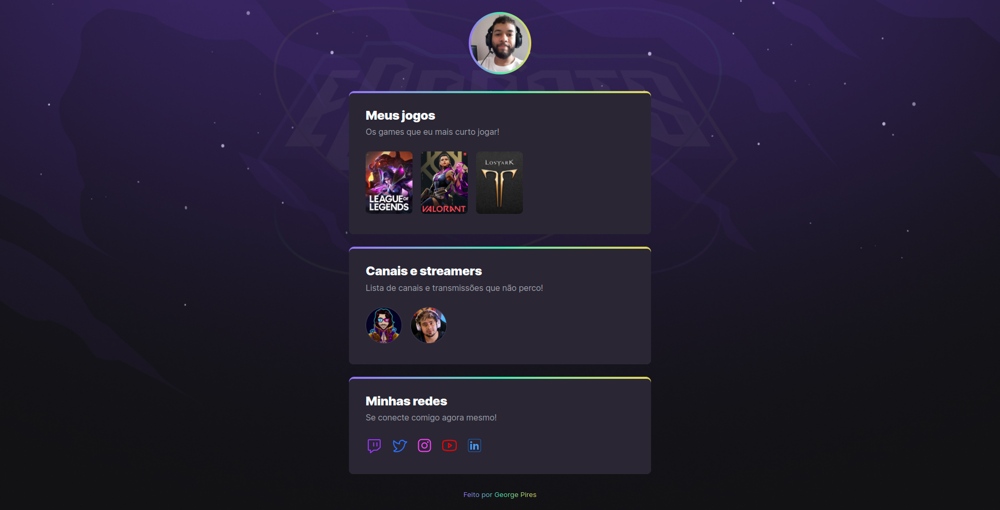

# NLW eSports - Trilha Explorer

 

  

 

# 💻 Projeto

Projeto desenvolvido durante o evento [Next Level Week](https://lp.rocketseat.com.br/nlw) da Rocketseat.

Você pode acessar o projeto através desse link: 
- [NLW-eSports](https://georgepires.github.io/NLW-eSports/)

---

## 👾 Tecnologias

Esse projeto foi desenvolvido com as seguintes tecnologias:

    
    
 

  

---
## 🔖 Layout

Você pode visualizar o layout do projeto através [desse link](https://www.figma.com/file/tY0PCAFoxcWYZC9trxlBac/NLW-eSports-(Community)?node-id=307%3A1884). É necessário ter conta no [Figma](https://figma.com) para acessá-lo.

----
